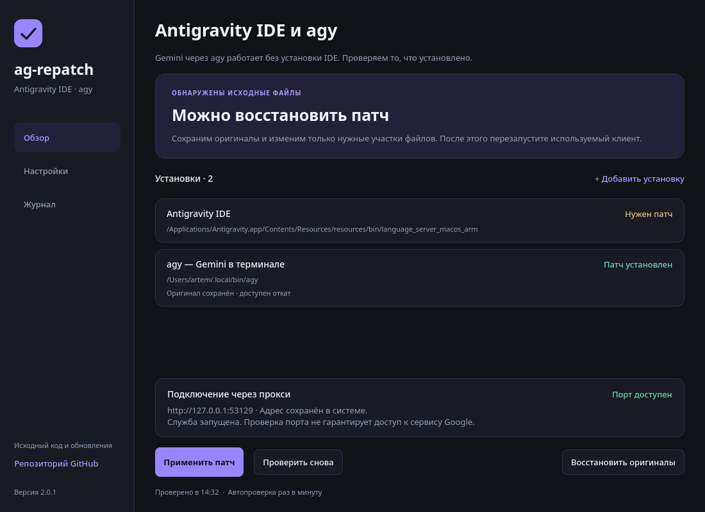
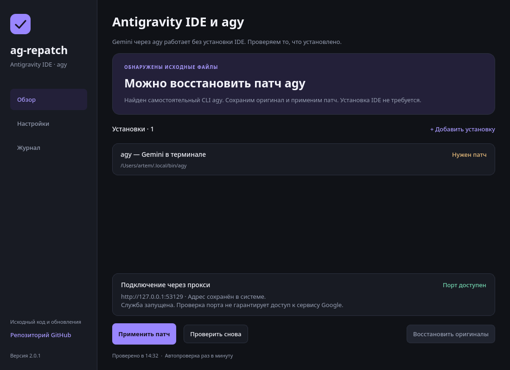
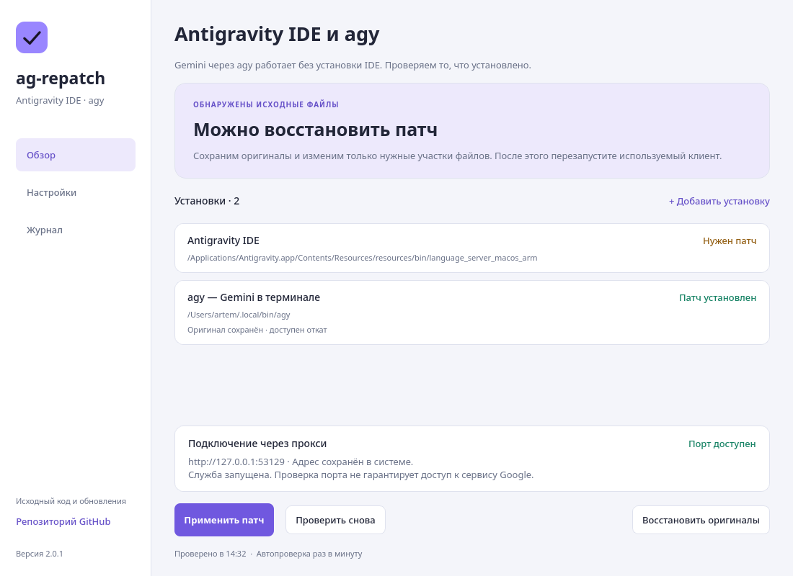

# ag-repatch

**Antigravity IDE и Gemini через `agy` — восстановление регионального патча в одном окне.**

Русский интерфейс · Windows · macOS · Linux

[Скачать приложение](#скачать-приложение) · [Как пользоваться](#как-пользоваться) · [Скриншоты](#скриншоты)

## Для чего это приложение

После обновления Antigravity ранее применённый региональный патч может исчезнуть: обновление заменяет изменённые файлы оригинальными. **ag-repatch находит установленные Antigravity IDE и Antigravity CLI (`agy`), показывает их состояние и позволяет повторно применить патч.**

### Gemini через `agy` — без установки IDE

**Пользуетесь Gemini в терминале через `agy`? Этот проект тоже для вас.** ag-repatch умеет патчить самостоятельный Antigravity CLI, через который вы работаете с моделями Gemini.

**Antigravity IDE устанавливать не нужно:** `agy` устанавливается отдельно и имеет собственный процесс авторизации. Можно использовать только CLI, только IDE или оба приложения. [Официальная инструкция установки и входа в `agy`](https://www.antigravity.google/docs/cli/install/).

Патч применяется к файлам IDE или бинарнику `agy`. Веб-версия Gemini в браузере и отдельная команда `gemini` этим патчем не изменяются.

В графическом приложении не нужно вводить команды. Вы видите, какие установки требуют изменений, доступен ли настроенный прокси и что делать дальше. Перед изменением файла сохраняется резервная копия.

> Для работы нужен установленный **Antigravity CLI (`agy`) и/или Antigravity IDE**. Сам прокси в ag-repatch не входит: приложение настраивает подключение к уже установленному прокси. Патч не заменяет авторизацию и не предоставляет дополнительные права доступа к моделям. Совместимость зависит от версии установленного приложения.

## Скачать приложение

**Пользователю не нужны Python, Git или сборка из исходников.** Достаточно скачать готовое приложение для своей системы.

### [Открыть страницу загрузок →](https://github.com/etosheartem/ag-repatch/releases)

Выберите файл для своей системы по ссылкам ниже или откройте последний релиз и раздел **Assets**. GitHub Actions предназначен для сборки проекта разработчиками; пользователю переходить туда не потребуется.

| Система | Файл для скачивания | Как запустить |
|---|---|---|
| Windows x64 | [Скачать `.exe`](https://github.com/etosheartem/ag-repatch/releases/latest/download/ag-repatch-windows-x64.exe) | Скачайте и откройте файл |
| macOS, Apple Silicon (M1 и новее) | [Скачать `.dmg` для Apple Silicon](https://github.com/etosheartem/ag-repatch/releases/latest/download/ag-repatch-macos-arm64.dmg) | Откройте образ и перенесите приложение в «Программы» |
| macOS, Intel | [Скачать `.dmg` для Intel](https://github.com/etosheartem/ag-repatch/releases/latest/download/ag-repatch-macos-x64.dmg) | Откройте образ и перенесите приложение в «Программы» |

Windows-приложение переносимое, отдельный установщик не требуется. Если включаете автозапуск, храните приложение в постоянной папке. На Mac тип процессора указан в меню Apple → «Об этом Mac».

Сборки по умолчанию не имеют доверенной подписи издателя и нотариализации Apple.

## Скриншоты

### Главное окно — тёмная тема

Состояние каждой установки, отдельная проверка прокси и основные действия на одном экране.

<strong>Только Gemini через agy — IDE не установлена</strong>

Приложение находит самостоятельный CLI и позволяет применить патч без установки Antigravity IDE.

<strong>Светлая тема</strong>

Можно выбрать светлое, тёмное оформление или следовать теме системы.

<strong>Настройки приложения</strong>

Адрес прокси, автоматическая проверка, автопатч и запуск при входе в систему.

Это снимки работающего интерфейса с демонстрационными данными. Список установок и их состояние на вашем компьютере будут отличаться.

## Что умеет ag-repatch

| Возможность | Что это даёт |
|---|---|
| Gemini через `agy` | Патчит самостоятельный Antigravity CLI; установка IDE не требуется |
| Поиск IDE и CLI | Находит стандартные установки; недостающую можно добавить вручную |
| Применение патча | Изменяет нужные участки распознанного файла, сохраняя его размер |
| Резервные копии | Сохраняет файлы перед патчем и позволяет вернуть прежнее состояние |
| Защита отката | Не подменяет обновлённую версию старой копией: проверяет совпадение хеша |
| Настройка прокси | Сохраняет адрес отдельно от глобального `HTTPS_PROXY` и проверяет доступность порта |
| Автоматизация | По вашему выбору проверяет обновления и повторно применяет патч |
| Журнал | Показывает подробности операций и позволяет скопировать их для разбора ошибки |
| Русский интерфейс | Светлая и тёмная темы, локализованные диалоги, ссылка на репозиторий в боковой панели |

## Как пользоваться

1. **Откройте ag-repatch.** Приложение само проверит установленные IDE и CLI.
2. **Закройте запущенную Antigravity IDE и сеансы `agy`**, если требуется применить патч, затем нажмите «Проверить снова».
3. **Нажмите «Применить патч».** Приложение сохранит предыдущую версию файлов и проверит результат записи.
4. **Проверьте блок прокси и запустите заново IDE или `agy`** — то приложение, которым пользуетесь. Состояние патча и состояние подключения отображаются отдельно.

Если установка не нашлась, нажмите **«Добавить установку»** и выберите папку приложения или исполняемый файл. Для отмены изменений используйте **«Восстановить оригиналы»** — кнопка доступна, когда есть подходящая резервная копия.

По умолчанию используется прокси `http://127.0.0.1:53129`. Другой адрес можно указать в настройках. «Порт доступен» означает, что к нему удалось подключиться; это не проверка работы сервиса Google.

### Работа в фоне

Автопроверка выполняется раз в минуту, пока запущен ag-repatch. **Автопатч и запуск при входе в систему по умолчанию выключены** — их можно включить в настройках. Если IDE или `agy` запущены, автоматическое применение патча откладывается.

При включённой автопроверке закрытие окна оставляет приложение в области уведомлений, если она доступна. Для полного выхода выберите «Завершить работу» в меню значка.

## Консольная версия и подробности

Консольный интерфейс сохранён: `python ag-repatch.py --check --lang ru` проверяет состояние без изменений. CLI использует стандартную библиотеку Python 3.8+; рядом со скриптом должна находиться папка `ag_repatch`.

Параметры CLI, устройство патча и хранение резервных копий описаны в **[подробной инструкции](README.ru.md)**.

Разработчикам: [запуск из исходников](README.ru.md#запуск-из-исходников), [сборка и выпуск версии](README.ru.md#сборка-exe-и-app), [тесты](README.ru.md#проверки).

## Лицензия

[MIT](LICENSE). Сведения о сторонних библиотеках — [THIRD_PARTY.txt](packaging/THIRD_PARTY.txt).
