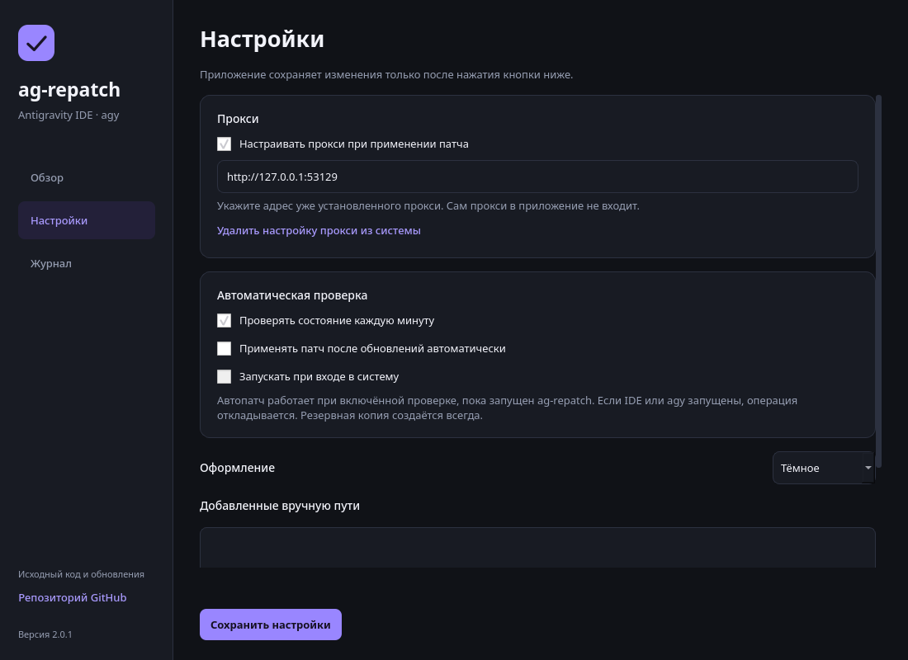

# ag-repatch — подробная инструкция

[← Описание приложения и скриншоты](README.md)

ag-repatch помогает повторно применить региональный патч после обновления Antigravity IDE или Antigravity CLI (`agy`), в том числе для работы с моделями Gemini через `agy`. Графический интерфейс работает на Windows, macOS и Linux и полностью переведён на русский язык. Ниже — подробности настройки, отката, сборки и работы из командной строки.

## Возможности

- Работа с Gemini через самостоятельный Antigravity CLI (`agy`), без обязательной установки IDE.
- Поиск Antigravity IDE и CLI, добавление файла или папки вручную.
- Отдельные состояния для каждого бинарника и подключения через прокси.
- Применение патча с резервной копией и проверкой результата записи.
- Восстановление сохранённой версии только при совпадении хеша текущего файла.
- Настройка и удаление пользовательской переменной `AG_LS_PROXY`.
- Русский интерфейс, светлое / тёмное оформление и тема системы.
- Журнал операций, копирование журнала и открытие папки резервных копий.
- Ссылка «Репозиторий GitHub» в боковой панели и меню значка приложения: открывает исходный код и страницу проекта в браузере.
- Проверка каждую минуту, пока приложение запущено. Автопатч и запуск при входе включаются отдельно в настройках.
- Значок в области уведомлений / строке меню, если платформа его поддерживает.

## Для пользователя

### Нужен ли Antigravity IDE для работы с `agy`?

**Нет.** Antigravity CLI (`agy`) устанавливается отдельно и выполняет авторизацию самостоятельно. Если вы хотите работать с Gemini через `agy`, устанавливать Antigravity IDE не требуется. ag-repatch находит и патчит CLI независимо от наличия IDE. [Установка и авторизация CLI — документация Google](https://www.antigravity.google/docs/cli/install/).

Для этого сценария нужны установленный `agy`, доступ к моделям через выбранный способ авторизации и рабочее подключение. Патч не заменяет авторизацию или прокси. Веб-версия Gemini и отдельная команда `gemini` не входят в область действия патча.

### Скачать ag-repatch

**Скачивание:** готовые приложения распространяются через [GitHub Releases](https://github.com/etosheartem/ag-repatch/releases). Выберите файл для своей системы в разделе Assets последнего релиза или воспользуйтесь [прямыми ссылками на скачивание](README.md#скачать-приложение).

**Windows:** откройте `ag-repatch-windows-x64.exe`. Python устанавливать не нужно. Приложение переносимое: отдельный установщик не требуется. Храните файл в постоянной папке, если включаете автозапуск.

**macOS:** откройте образ `.dmg`, перенесите `ag-repatch.app` в «Программы» и запустите. Для Apple Silicon и Intel нужны соответствующие сборки.

Пользователю не нужно устанавливать инструменты разработки, запускать GitHub Actions или собирать приложение. По умолчанию сборки не имеют доверенной подписи издателя и нотариализации Apple.

### Обычный запуск

1. Откройте ag-repatch: проверка начнётся автоматически.
2. Закройте запущенную Antigravity IDE и сеансы `agy`, затем нажмите «Проверить снова».
3. Нажмите «Применить патч».
4. Проверьте состояние прокси и запустите заново используемое приложение: IDE или `agy`.

Если установка не найдена, используйте «Добавить установку». Можно выбрать исполняемый файл `agy` / `language_server*` или корневую папку установки; пакет `.app` разворачивается до `Contents/Resources`.

Прокси **не входит** в приложение. По умолчанию используется `http://127.0.0.1:53129`. ag-repatch может запустить уже установленную службу разблокировщика. Индикатор «Порт доступен» означает успешное TCP-подключение, а не проверку авторизации, модели или доступности Google.

### Откат и автоматизация



Скриншот показывает настоящий интерфейс с демонстрационными настройками.

«Восстановить оригиналы» возвращает байты, сохранённые перед применением патча через GUI. Если до этого файл был частично пропатчен, будет восстановлено именно это предыдущее состояние. Файлы, изменённые после создания копии, не откатываются наугад. После восстановления автоматический патч выключается; настройка прокси остаётся.

Автопатч по умолчанию выключен. При включении он проверяет состояние раз в минуту, ждёт закрытия IDE и сеансов `agy` и не вызывает запросы повышения прав в фоне. Неудачная попытка для неизменившихся файлов не повторяется каждую минуту; можно повторить её вручную или пересохранить настройки.

При включённой автопроверке закрытие окна оставляет приложение в области уведомлений, если она доступна. Для полного выхода выберите «Завершить работу». Без поддержки значка закрытие окна завершает приложение. Автозапуск регистрируется только по вашему выбору, для текущего пользователя Windows/macOS.

При отсутствии прав на Windows появляется кнопка перезапуска с правами администратора. На macOS необходимо иметь права записи в папку установки; приложение не меняет её разрешения автоматически.

## Запуск из исходников

Этот раздел предназначен для разработчиков. Для обычного использования скачайте готовое приложение из Releases.

Для GUI нужен Python 3.10+ и Qt for Python (PySide6). Команды ниже выполняются из корня скачанного репозитория.

**Windows — PowerShell:**

```powershell
py -m venv .venv
.venv\Scripts\python.exe -m pip install -e .
.venv\Scripts\pythonw.exe ag-repatch-gui.py
```

**macOS и Linux:**

```bash
python3 -m venv .venv
.venv/bin/python -m pip install -e .
.venv/bin/python ag-repatch-gui.py
```

Команды выполняются из корня скачанного репозитория. Они используют Python из виртуального окружения, поэтому отдельная активация не нужна. После установки пакета в окружении также доступна команда `ag-repatch-gui`. Готовый `.exe` собирается без консоли.

### Консоль

CLI по-прежнему использует только стандартную библиотеку Python 3.8+. Теперь ему нужна папка `ag_repatch` рядом со скриптом: скачивайте репозиторий целиком.

```bash
python ag-repatch.py --check --lang ru
python ag-repatch.py --lang ru
python ag-repatch.py --no-env --lang ru
python ag-repatch.py --unset --lang ru
python ag-repatch.py --selftest
```

`--unset` только удаляет настройку прокси: не патчит файлы и работает без установленного Antigravity. `--check` и `--unset` взаимоисключающие. Аргументы-пути дополняют автоматический поиск. CLI сохраняет прежний алгоритм точечной записи; резервные копии и проверяемый откат реализованы в GUI.

## Сборка `.exe` и `.app`

Сборку запускают **на целевой ОС**: Windows для `.exe`, macOS для `.app` / `.dmg`. PyInstaller не является кросс-компилятором: [документация](https://pyinstaller.org/en/stable/).

```bash
python -m pip install ".[build]"
python packaging/build.py
```

Результат:

| ОС | Артефакт |
|---|---|
| Windows | `dist/ag-repatch.exe` — переносимый файл без консоли |
| macOS | `dist/ag-repatch.app`, `dist/ag-repatch-macos.dmg` |
| Linux | `dist/ag-repatch/ag-repatch` с библиотеками в той же папке |

Workflow `.github/workflows/desktop.yml` собирает Windows x64, macOS arm64 и macOS x64, запускает тесты и проверяет запуск упакованного приложения через `--smoke-test`. При отправке тега `v*` дополнительная задача публикует готовые файлы в GitHub Releases. Обычные коммиты и pull request создают только артефакты для разработчиков. Проверка сборки не читает установки и не меняет окружение пользователя. Для публичного распространения доверенную подпись Windows и подпись/нотариализацию Apple нужно настроить отдельно с сертификатами владельца проекта.

### Выпуск версии для пользователей

1. Обновите версию приложения и отправьте проверенные изменения в репозиторий.
2. Создайте и отправьте тег версии, например `v2.0.0`.
3. Дождитесь успешного завершения workflow **Desktop builds**: он проверит и соберёт все три варианта приложения, затем создаст релиз с `.exe`, двумя `.dmg` и файлом контрольных сумм `SHA256SUMS.txt`.
4. Проверьте страницу Releases. Теперь пользователи могут скачать готовое приложение по ссылке из README.

Публикация выполняется только для тегов `v*` и только после успешной сборки всех платформ. Исходники `.github/workflows/desktop.yml` сами по себе не создают релиз: workflow должен попасть в репозиторий и выполниться для отправленного тега.

## Проверки

```bash
python ag-repatch.py --selftest
python -m unittest discover -s tests -v
python ag-repatch-gui.py --smoke-test
```

На Linux без дисплея добавьте `QT_QPA_PLATFORM=offscreen`. Тесты используют временные файлы и подменяют системные операции. Покрыты точность и идемпотентность патча, резервные копии разных версий, отказ при повреждении копии, изменение файла во время операции, откат после ошибки записи, настройки, `--unset`, состояния UI и выполнение фоновых задач.

Проверки на искусственных файлах не доказывают совместимость патча со всеми версиями Antigravity. На macOS изменение подписанного бинарника может нарушить его подпись; автоматическое переподписание Antigravity не выполняется.

## Устройство проекта

| Файл | Назначение |
|---|---|
| `ag-repatch-gui.py` | Запуск графического приложения |
| `ag_repatch/gui.py` | Русский интерфейс, фоновые задачи, таймер и значок |
| `ag_repatch/backend.py` | Настройки, диагностика, резервные копии, применение и откат |
| `ag_repatch/engine.py` | Общий поиск бинарников, сигнатуры, окружение и службы |
| `ag_repatch/startup.py` | Автозапуск и повышение прав на Windows |
| `ag-repatch.py` | Консольный интерфейс и прежние самотесты |
| `packaging/` | Сборка приложений и генерация превью |
| `tests/` | Тесты операций и интерфейса |

В бинарниках выполняются замены одинаковой длины: `ineligible → inexigible`, `https_proxy → AG_LS_PROXY`. Если одна из пар не найдена ни в исходном, ни в пропатченном виде, запись не выполняется. Распознавание основано на строках, а не на списке проверенных версий.

Оригинал и метаданные сохраняются до изменения файла. При обычной ошибке записи приложение пытается вернуть исходные байты. Резервные копии сохраняются для восстановления и не удаляются автоматически; это требует свободного места. Сбой питания или принудительное завершение не дают гарантии атомарности нескольких записей. При частично записанном файле копия остаётся доступной для ручного восстановления.

Настройки, журнал и резервные копии хранятся в:

- Windows: `%LOCALAPPDATA%\ag-repatch`
- macOS: `~/Library/Application Support/ag-repatch`
- Linux: `$XDG_DATA_HOME/ag-repatch` или `~/.local/share/ag-repatch`

Журнал ограничен файлами примерно по 1 МБ с тремя архивами. Телеметрии нет; сетевая диагностика только подключается к указанному пользователем адресу прокси.

Лицензия проекта — [MIT](LICENSE). Сведения о библиотеках — [THIRD_PARTY.txt](packaging/THIRD_PARTY.txt).
